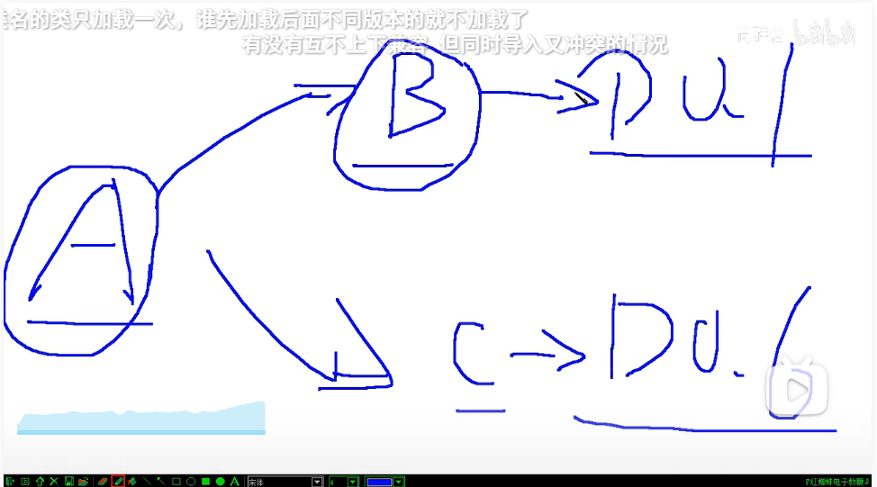

# Maven - basic

### 依赖范围 scope

标签位置：dependencies/dependency/scope

标签可选值： compile, test, provided, system, runtime, import

|          | main directory                           | test directory | 开发中 | 部署到服务器后                                  |
| -------- | ---------------------------------------- | -------------- | --- | ---------------------------------------- |
| compile  | Y                                        | Y              | Y   | Y                                        |
| test     | <mark style="color:orange;">**N**</mark> | Y              | Y   | <mark style="color:orange;">**N**</mark> |
| provided | Y                                        | Y              | Y   | N                                        |

### 依赖排除

<figure><figcaption></figcaption></figure>

### 继承 inheritance

继承，准确地说是继承父工程的 <mark style="color:green;">pom.xml 配置</mark>。更准确说是为了**版本**管理。

使用 framework 时所需要的 jar 包组合，需要经过长期的摸索和反复调试 （比如上图，一调试才发现D0.1 和 0.2冲突，得排一个），最终确定一个可用组合。这个耗费很大精力总结出的方案不应在新项目重新摸索。通过父工程维护所有依赖信息组合，能将以往经验沉淀下来。

举例，使用 Spring 时要求所有 Spring 自己的 jar 包版本一致。

**groupId**

子工程的 groupId, 如果和父工程一样，则可以省略

